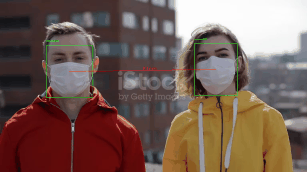
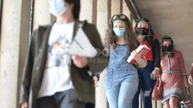

# YOLO Model Comparison for Mask and Person Detection

## **Project Purpose**
This project compares the performance of different YOLO models in detecting:
1. **Persons** and **face masks**.
2. **Social distancing** by measuring distances between detected persons.

The goal is to evaluate model efficiency and accuracy under real-world conditions.

## <strong>Project Demonstration</strong>

### <strong>Mask/No Mask (Small Distance)</strong>


<p style="font-size: 10px; font-style: italic;">
  Source: <a href="https://www.istockphoto.com/de/video/virusepidemie-ist-in-einer-stadt-beendet-frau-und-mann-nehmen-chirurgische-masken-gm1212372184-351930090" target="_blank">iStock</a>
</p>

### <strong>Multiple Persons (Small Distance)</strong>


<p style="font-size: 10px; font-style: italic;">
  Source: <a href="https://www.istockphoto.com/de/video/überfüllte-menschen-die-eine-gesichtsmaske-tragen-um-coronavirus-oder-covid-19-gm1217776095-355595911" target="_blank">iStock</a>
</p>

### <strong>Multiple Persons (Great Distance)</strong>


<p style="font-size: 10px; font-style: italic;">
  Source: <a href="https://www.istockphoto.com/de/video/studenten-tragen-masken-auf-dem-campus-gm1267958948-372111685" target="_blank">iStock</a>
</p>


## **Installation**
Follow these steps to set up the project:

1. Clone this repository:
   ```bash
   git clone https://github.com/l-lattermann/yolo-mobilenet-realtime-mask-detection.git
   cd <repository_directory>
   ```

2. Install the required dependencies:
   ```bash
   pip install -r requirements.txt
   ```

3. (Optional) Ensure YOLO models are available in the `models` directory. You can download pre-trained models from [Ultralytics](https://github.com/ultralytics/yolov5).

---

## **Project Structure**
- **`data_sets/`**  
  Contains images and video datasets for testing models.

  - **`image_data/`**  
    Directory for storing image datasets.

  - **`video_data/`**  
    Directory for storing video datasets.

- **`models/`**  
  Stores YOLO model weights and configurations.

  - **`yolov8n_mask.pt`**  
    YOLOv8 nano model trained for mask detection.

  - **`yolov8n_person.pt`**  
    YOLOv8 nano model trained for person detection.

  - **`yolov11n_mask.pt`**  
    YOLOv11 nano model trained for mask detection.

  - **`yolov11n_person.pt`**  
    YOLOv11 nano model trained for person detection.

- **`scripts/`**  
  Includes utility scripts for inference and video processing.

  - **`cam_calibration.py`**  
    Script for camera calibration.

  - **`cv2_functions.py`**  
    Contains OpenCV helper functions.

  - **`frame_fetcher.py`**  
    Fetches frames from video sources.

- **`tests/`**  
  Contains test scripts and output data.

  - **`video_test_output/`**  
    Folder that stores the annotated videos.

  - **`test_mp4.ipynb`**  
    Jupyter notebook for testing mp4 video inputs.

  - **`test_path_handling.py`**  
    Script for testing path handling.

  - **`test_webcam.ipynb`**  
    Jupyter notebook for testing webcam inputs.

  - **`understand_yolo_tensor_structure.ipynb`**  
    Notebook for exploring YOLO tensor outputs.

- **`training/`**  
  Results and logs from model training and testing.

  - **`yolov11n_mask_100epochs/`**  
    Training results for YOLOv11 mask model.

  - **`yolov11n_person_100epochs/`**  
    Training results for YOLOv11 person model.

  - **`yolov8n_mask_100epochs/`**  
    Training results for YOLOv8 mask model.

  - **`compare_train_args.ipynb`**  
    Notebook comparing different training arguments.

  - **`train_yolo_colab_nb.ipynb`**  
    Notebook for training YOLO models on Google Colab.

  - **`training_arg_comparison.xlsx`**  
    Excel sheet with training argument comparisons.

- **`.gitignore`**  
  Specifies files and directories to be ignored by Git.

- **`config.py`**  
  Configuration of file paths for the project.

- **`main_live_cam.py`**  
  Script for running YOLO inference on live camera feed.

- **`main_test_video.py`**  
  Script for running YOLO inference on test videos.

- **`README.md`**  
  Project documentation.

- **`requirements.txt`**  
  List of required Python packages for the project.